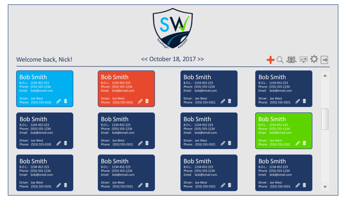

# Angular interface
  

install yarn: `npm install -g yarn`

### For run Angular:
1. `cd ./angular/`
2. `npm install`
3. `npm run start`
4. see result on `http://localhost:8080/`

### For run React:
1. `cd ./react/routed-react/`
2. `npm install`
3. `yarn start`
4. see result on `http://localhost:3000/`